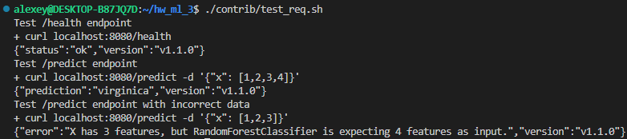
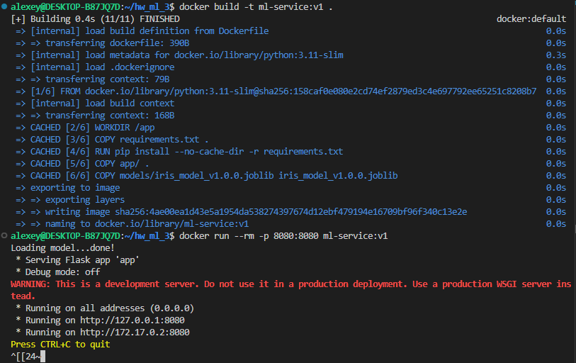
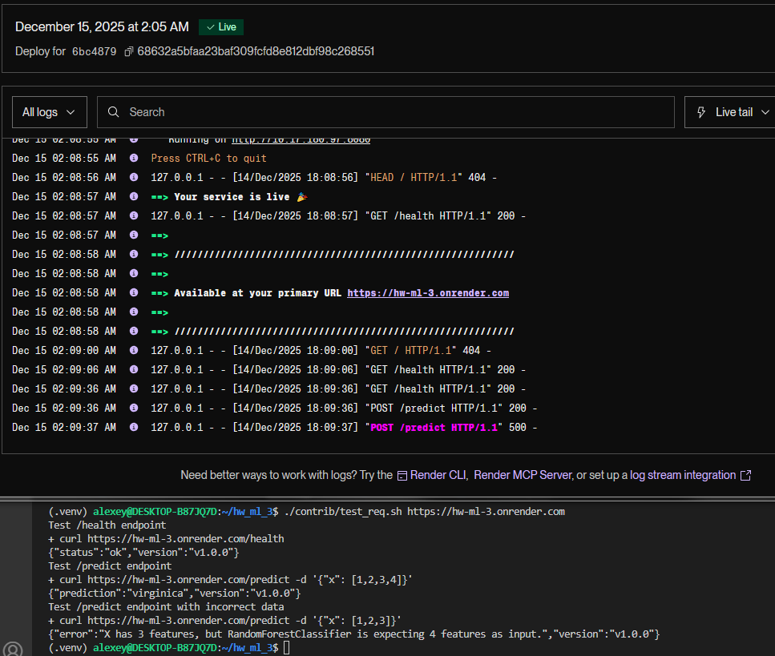
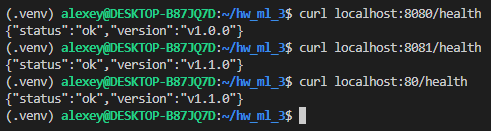

HW_ML_3
=======

Демонстрационный проект ML-сервиса со стратегией развертывания модели. Деплой реализован на [hw-ml-3.onrender.com](https://hw-ml-3.onrender.com/).

Структура проекта:
```
hw_ml_3/
 ├── app/
 │    └── app.py
 ├── models/
 │    ├── iris_model_v1.0.0.joblib
 │    └── iris_model_v1.1.0.joblib
 ├── requirements.txt
 ├── Dockerfile
 └── README.md
```

## Команды сборки и запуска

### Локальная машина

Сборка и запуск на локальной машине (linux):

```bash
# Установка python-зависимостей
python3 -m venv .venv
source .venv/bin/activate
pip3 install -r requirements.txt
# Генерация ML-моделей
./contrib/prepare_dir.sh
# Запуск сервера
python3 app/app.py
# Отправка запросов для теста (другой терминал)
./utils/test_req.sh
```

### Контейнер

Сборка и запуск контейнера:

```bash
# Сборка
docker build -t ml-service:v1 .
# Запуск
docker run --rm -p 8080:8080 ml-service:v1
# Отправка запросов для теста (другой терминал)
./utils/test_req.sh
```

### Примеры вызовов /health и /predict

Отправка запросов (/health чуть-чуть отличается, см. в [метрики](#метрики)):



### Скриншоты вывода команд после запуска контейнера

Сборка и запуск контейнера:



### Скриншот работы сервиса после auto-deploy



Примечание: когда будет делаться запрос вручную, первый ответ может быть ОЧЕНЬ долгим, так как `Your free instance will spin down with inactivity, which can delay requests by 50 seconds or more.`.

### Реализация стратегии развертывания

Вариант A — Blue-Green Deployment.

#### Запуск и проверка:

```bash
# V1.0.0
docker compose -f docker-compose.blue.yml up -d
# V1.1.0
docker compose -f docker-compose.green.yml up -d
# Прокси
docker run --name proxy-nginx -v $(pwd)/nginx.conf:/etc/nginx/conf.d/default.conf:ro -d --network host nginx:mainline-alpine3.23
```

Проверка:



Стратегия переключения версии (переключение трафика и откат при ошибках новой версии, то есть rollback):

1. Редактируем nginx.conf (комментируем текущую версию и раскоментируем нужную версию, то есть адрес).
2. Выполняем `docker exec -it proxy-nginx nginx -s reload`.
3. Готово. Новая конфигурация nginx загрузилась, траффик перенаправлен.


#### Метрики

Метрики можно получить из /health:

```bash
$ curl localhost:8080/health
{"metrics":{"accuracy":1.0,"f1_score":1.0,"precision":1.0,"recall":1.0},"status":"ok","version":"v1.1.0"}
```

Все метрики оценивают точность модели. Данные `iris_data` простые, так что обе версии модели (что v1.0.0 (`RandomForestClassifier`), что v1.1.0 (`LogisticRegression`)) справились отлично.

Теоретически, при снижении показателей, то есть метрики, нужно делать rollback модели.
